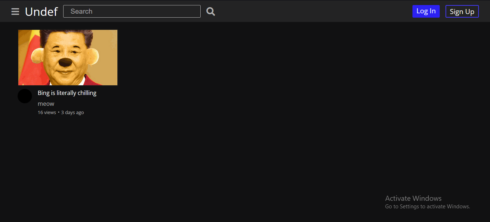
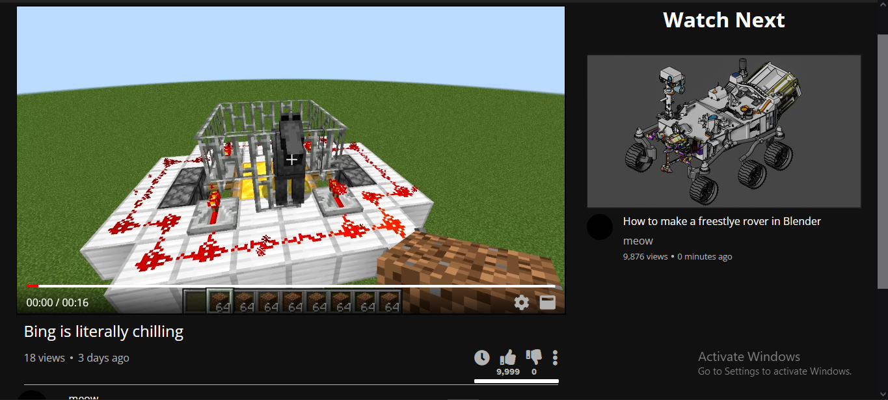
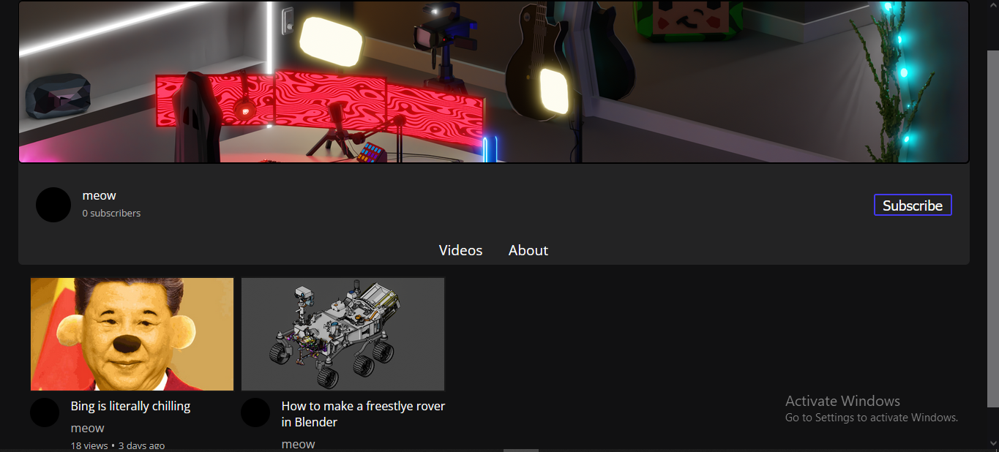
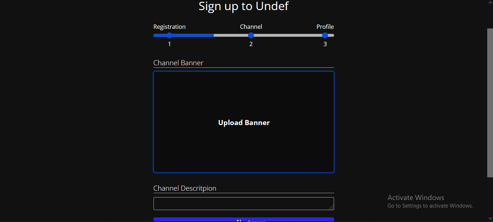

# Undef
Undef, a Youtube clone.
**WIP**
---

**Watch vides**
---

**View channels**
---

**Interactive forms**
---

## How to run
* Clone this repo
* Open 2 terminals
* `cd frontend => npm run dev`
* `cd musicifyApi => python manage.py runserver`
* **(Optional - Make changes to css)** `npm run postcss-run`

### Desc
This project is still in it's infacy so there are many features that need to be added.